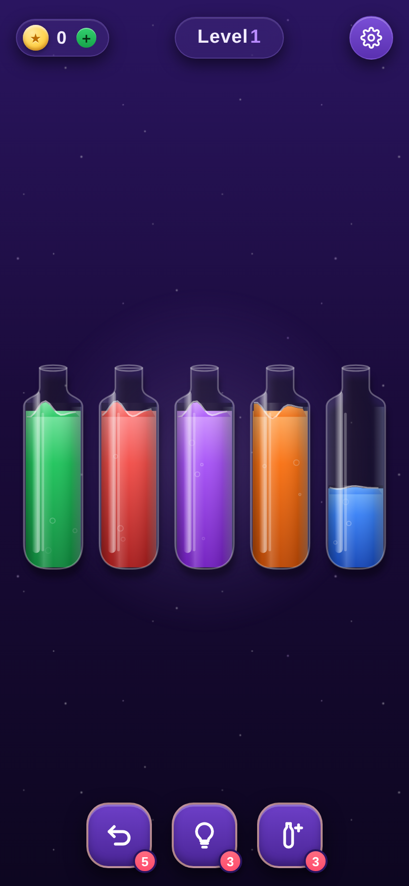

# 🧪 PuruPop

「Magic Sort!」風の色分けソートパズル。ボトルに入り混じった色付きのポーションを注ぎ分け、各ボトルを単色にそろえるとクリア——つまんだ瞬間に**プルンと弾む**ジェリーのような揺れ、完成した瞬間に**はじけるポップ演出**が弾けます。ピンクを基調にした、かわいさ重視のビジュアル。依存ライブラリなしのバニラ HTML / CSS / JS で動作します。

> 旧名は「Water Puzzle」→「PotionPop」。同名タイトルとの重複を避け、よりかわいい響きの **PuruPop** に改名しました（リポジトリ名は GitHub の Settings → Rename からご自身で変更できます）。

| Gameplay | Pour | Complete FX | Clear |
| --- | --- | --- | --- |
|  |  |  |  |

## 遊び方

1. ボトルをタップして持ち上げます（コルクが外れ、一番上の色がつかまれます）。
2. 別のボトルをタップすると、そこへ注ぎます。ボトルが**持ち上がって傾き**、注ぎ口から液体が流れ込みます。
3. 注げるのは **注ぎ先が空** か **一番上の色が同じ** ときだけ。連続した同じ色はまとめて移動します。
4. すべてのボトルが「空」または「単色でいっぱい」になればクリア！

## パワーアップ（リワード広告エコノミー）

下部の3つのボタンには残数バッジが付き、使うと1つ消費します。**0 になると「＋」表示に変わり、タップすると入手画面が開きます**。そこで **動画広告（シミュレート）を無料で見る**か、**コインで購入**するかを選べて、いずれも1回分もらってその場で発動します（Magic Sort 型の F2P ループ）。

| アイコン | パワーアップ | 動作 | 購入価格 |
| --- | --- | --- | --- |
| ↩ | **Undo** | 直前の一手を取り消す（キー: `U`） | 🪙60 |
| 💡 | **Hint** | 内蔵ソルバーが次の一手をハイライト（キー: `H`） | 🪙90 |
| 🧪＋ | **+Bottle** | 空のボトルを1本追加（キー: `B`） | 🪙140 |

- クリアで**コイン**を獲得（基本 40 ＋ スター数 × 30）。
- **左上のコイン（＋付き）をタップするといつでもショップ**が開き、コインで各パワーアップを購入して在庫に追加できます。残数・コインは `localStorage` に保存されます。
- ⚙️ 設定：サウンド ON/OFF、レベルのやり直し（現在の配置に戻して手数リセット）。

## 特徴

- **上質なキャンディポップ配色**：Royal Match / Candy Crush 級の一流タイトルにならい、色を足すのではなく絞り込んで作った配色。背景は盤面の裏に1つだけ据えた大きなマゼンタのヒーローグロー＋ビネット（周辺減光）で視線を中央に集め、微細なフィルムグレインで安っぽいフラットグラデを回避。UI の配色は**ピンク／バイオレット（ブランド主色）＋ゴールド（コイン・ヒント・お祝いリボンすべてで共通の1系統だけを使用）＋エメラルドミント（Nextボタン専用の単一CTA色）**の3系統に統一——似て非なる複数のアンバー色が混在していた状態を解消し、アプリ全体でどのボタンも同じ意味の色は必ず同じ色で塗るように徹底しています。ボタンやカードの縁取り・ツヤ（グロスハイライト）も全コンポーネントで共通レシピにそろえ、パーツごとに仕上げがバラつかないようにしました。
- **フォントはひとつだけ**：見出しからボタン、数字、細かいラベルまで、すべて丸みのある高視認性フォント「Baloo 2」に統一。子供から大人まで誰でも一瞬で読める太さ・形にそろえています。UI は英語・アイコン中心。
- **クセになるフィードバック**：コインが増減するたびにカウントアップし、コインピルがキュッとバウンド。獲得の瞬間が気持ちよく積み重なるように演出しています。
- **プルンと弾むジェリー演出**：ボトルをつまむと**プルプル**とジェリーのようにスクワッシュ&ストレッチ。注ぎが終わって着地する瞬間にも、注ぎ元・注ぎ先の両方が小さく弾みます。
- **ボトルが傾く注ぎ演出**：注ぐボトルが持ち上がって傾き、放物線状の液体が注ぎ先へ。注ぎ元は減り、注ぎ先はせり上がって波打ちます。
- **本物の液体表現**：Canvas でリアルタイム描画。円柱シェーディング、波打つ水面とメニスカスの光沢、立ちのぼる気泡、着水の波紋、ガラスの反射。
- **完成/クリア演出**：ボトルが単色で満タンになると、放射フラッシュ＋二重の衝撃リング＋弾け飛ぶスパークル＋**はじけるポップ・バブル**＋スクワッシュ・バウンドで祝福。クリア時は全ボトルが連鎖ポップ→紙吹雪＋**スター評価（最短手数と比較して★1〜3）**＋獲得コイン表示。
- **必ず解ける盤面**：内蔵ソルバーで検証済みの盤面だけを出題。最短手数はバックグラウンドで計算します。
- **サウンド**：すべて WebAudio 合成（音源ファイル不要）。ジューシーな効果音（選択・注ぎ・完成・コイン・クリア）に加え、常時ループする穏やかな **BGM**（C–G–Am–F のパッド＋ベース＋アルペジオ）。⚙️ 設定で効果音・BGM を個別にオン/オフでき、設定は保存されます。
- **モバイル対応**：レスポンシブ、タッチ操作、Retina 対応の高精細描画。ボトルは本数が増えても**一定のスリム幅で自動整列**し、見切れません。

## 実行方法

ビルド不要です。任意の静的サーバーで開くか、ファイルを直接開くだけ:

```bash
# 例: Python の簡易サーバー
python3 -m http.server 8000
# → ブラウザで http://localhost:8000 を開く
```

## Vercel へのデプロイ

ビルド不要の静的サイトなので、Vercel に **設定ゼロ** でそのまま公開できます（`vercel.json` はクリーン URL とキャッシュ最適化のための任意設定です）。

### 方法 A: ダッシュボードから（おすすめ）

1. [vercel.com/new](https://vercel.com/new) を開き、この GitHub リポジトリをインポート。
2. Framework Preset は **Other**、Build Command と Output Directory は **空のまま**（＝リポジトリ直下をそのまま配信）。
3. **Deploy** を押すと数秒で公開 URL が発行されます。以降は push するたびに自動デプロイされます。

### 方法 B: Vercel CLI から

```bash
npm i -g vercel
vercel        # プレビュー環境へデプロイ
vercel --prod # 本番環境へデプロイ
```

初回は対話でプロジェクト設定を聞かれます。**すべてデフォルト（ビルドなし）** で進めれば OK です。

### カスタムドメイン & 本番公開

1. Vercel の **Project → Settings → Domains** で独自ドメインを購入 / 追加。
2. **Settings → Git** の **Production Branch** を `claude/water-puzzle-game-8a215u`（このリポジトリの既定ブランチ）にしておくと、push で本番が自動更新されます。
3. 最新コミットが本番に出ていない場合は **Deployments** で最新デプロイを開き `⋯ → Promote to Production`。
4. 反映後はブラウザを **ハードリロード**（Ctrl/Cmd+F5）で確認。

### Vercel のドメインが複数に分かれてしまったときは

`*.vercel.app` の URL が2つ以上できてしまう場合、多くは次のどちらかです（Vercel のダッシュボード操作が必要で、Claude からは直接統一できません）。

**ケース A：同じプロジェクトに複数ドメインがぶら下がっている**
Vercel はブランチ名入りの自動 URL（`purupop-git-<branch>-<team>.vercel.app`）と、デプロイごとの固定 URL（`purupop-<hash>-<team>.vercel.app`）を毎回発行します。これは仕様で、これ自体は問題ではありません。**常に使う1本に絞りたい場合**は、Project → Settings → Domains で使いたいドメイン（独自ドメイン、または `xxx.vercel.app`）を追加し、行の `Edit` から他のドメインを「**Redirect to**」でそのドメインへ301リダイレクトするよう設定してください。

**ケース B：プロジェクトそのものが2つに分かれている**
GitHub リポジトリ名を `Water-Puzzle` → `PotionPop` → `PuruPop` と変更した際、Vercel 側で**別プロジェクトとして再インポートされ、新旧2つのプロジェクトが並存している**ことがあります。この場合は Vercel ダッシュボードのプロジェクト一覧を確認し、①現在のリポジトリ（`PuruPop`）に接続されている方を残す、②使われていない旧プロジェクト（`water-puzzle` 等の名前）を Settings → Advanced → **Delete Project** で削除、③独自ドメインは残す方のプロジェクトの Settings → Domains に付け直す、という手順で1本化してください。

### PWA / 共有

- `manifest.webmanifest` とアイコン（`icon-192/512.png`, `apple-touch-icon.png`, `favicon.svg`）を同梱。スマホの **「ホーム画面に追加」** でアプリのように起動できます（全画面 standalone）。
- `og-image.png` と OG/Twitter メタを設定済みで、リンク共有時にカード表示されます。ドメイン確定後、より確実なプレビューにするなら `index.html` の `og:image` / `twitter:image` を **絶対URL** に置き換えてください。

## ファイル構成

| ファイル | 役割 |
| --- | --- |
| `index.html` | 画面構造（HUD・盤面キャンバス・クリア/設定/広告モーダル） |
| `style.css` | UI スタイル・星空背景・アニメーション |
| `game.js` | ゲームロジック＋Canvas ボトルレンダラー（生成・注ぎ判定・BFSソルバー・傾き注ぎ・気泡・パワーアップ経済・リワード広告・コイン・紙吹雪・効果音） |

## ライセンス

MIT
