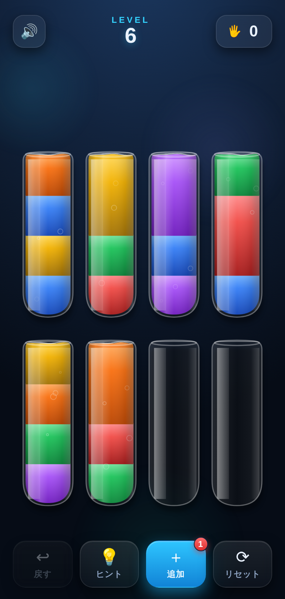
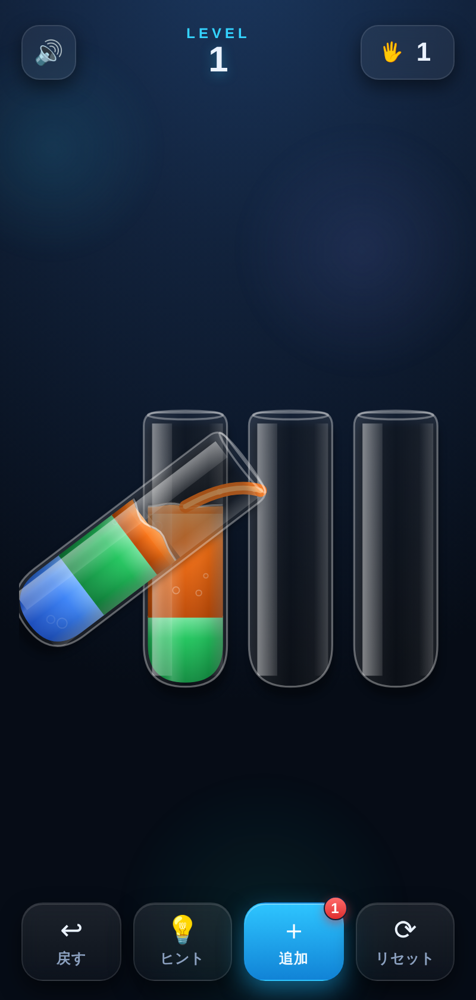
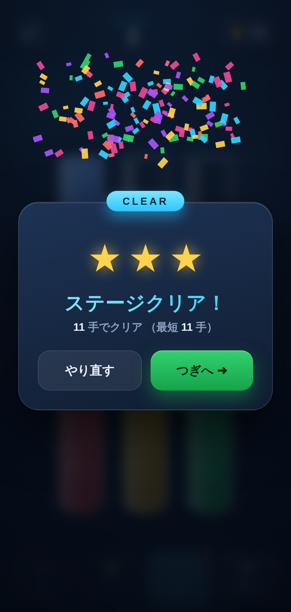

# 💧 Water Puzzle

「Magic Sort!」風の色分けソートパズル。試験管に入り混じった色水を注ぎ分け、各試験管を単色にそろえるとクリアです。依存ライブラリなしのバニラ HTML / CSS / JS で動作します。

| ゲーム画面 | 注ぐ演出 | クリア |
| --- | --- | --- |
|  |  |  |

## 遊び方

1. 試験管をタップして持ち上げます（一番上の色水がつかまれます）。
2. 別の試験管をタップすると、そこへ注ぎます。試験管が**持ち上がって傾き**、注ぎ口から水が流れ込みます。
3. 注げるのは **注ぎ先が空** か **一番上の色が同じ** ときだけ。連続した同じ色はまとめて移動します。
4. すべての試験管が「空」または「単色でいっぱい」になればクリア！

### 操作ボタン

| ボタン | 機能 |
| --- | --- |
| 🔊 サウンド | 効果音のオン/オフ（設定は保存されます） |
| ↩ 戻す | 直前の一手を取り消す（キー: `U`） |
| 💡 ヒント | 内蔵ソルバーが次の一手をハイライト（キー: `H`） |
| ＋ 追加 | 空の試験管を1つ追加（各レベル1回だけ、詰まったときの救済） |
| ⟳ リセット | 現在のレベルを最初からやり直す（キー: `R`） |

## 特徴

- **試験管が傾く注ぎ演出**：注ぐ試験管が持ち上がって傾き、注ぎ口から放物線状の水流が注ぎ先へ。注ぎ元は減り、注ぎ先はせり上がって波打ちます。
- **本物の液体表現**：Canvas でリアルタイム描画。円柱シェーディング、波打つ水面とメニスカスの光沢、立ちのぼる気泡、着水の波紋、ガラスの反射までを描き込み“水”として見せます。
- **クリア演出**：紙吹雪と**スター評価（最短手数との比較で★1〜3）**、クリアした手数を表示。
- **ヒント & 効果音**：詰まっても最短手順の一手を提示。WebAudio 合成の効果音（音源ファイル不要）。
- **必ず解ける盤面**：ランダム生成した各レベルを内蔵ソルバーで検証し、解が存在する盤面だけを出題。最短手数はバックグラウンドで計算します。
- **難易度カーブ**：レベルが上がるほど色数が増加（最大12色）。予備の空試験管は常に2本。
- **進行の保存**：クリアしたレベルは `localStorage` に記録され、次回は続きから。
- **モバイル対応**：レスポンシブなレイアウト、タッチ操作、Retina 対応の高精細描画。

## 実行方法

ビルド不要です。任意の静的サーバーで開くか、ファイルを直接開くだけ:

```bash
# 例: Python の簡易サーバー
python3 -m http.server 8000
# → ブラウザで http://localhost:8000 を開く
```

## Vercel へのデプロイ

ビルド不要の静的サイトなので、Vercel に **設定ゼロ** でそのまま公開できます（`vercel.json` はクリーン URL とキャッシュ最適化のための任意設定です）。

### 方法 A: ダッシュボードから（おすすめ）

1. [vercel.com/new](https://vercel.com/new) を開き、この GitHub リポジトリをインポート。
2. Framework Preset は **Other**、Build Command と Output Directory は **空のまま**（＝リポジトリ直下をそのまま配信）。
3. **Deploy** を押すと数秒で公開 URL が発行されます。以降は push するたびに自動デプロイされます。

### 方法 B: Vercel CLI から

```bash
npm i -g vercel
vercel        # プレビュー環境へデプロイ
vercel --prod # 本番環境へデプロイ
```

初回は対話でプロジェクト設定を聞かれます。**すべてデフォルト（ビルドなし）** で進めれば OK です。

## ファイル構成

| ファイル | 役割 |
| --- | --- |
| `index.html` | 画面構造（HUD・盤面キャンバス・クリア演出） |
| `style.css` | UI スタイル・アニメーション |
| `game.js` | ゲームロジック＋Canvas 液体レンダラー（生成・注ぎ判定・BFSソルバー・傾き注ぎ・気泡・紙吹雪・効果音） |

## ライセンス

MIT
