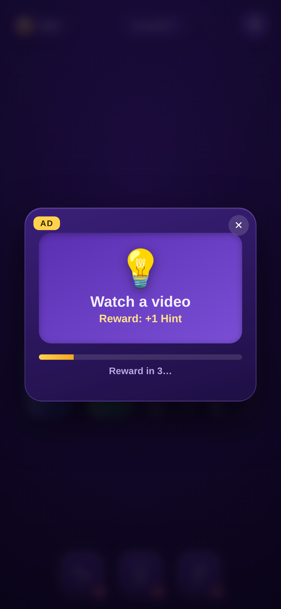

# 💧 Water Puzzle

「Magic Sort!」風の色分けソートパズル。試験管に入り混じった色水を注ぎ分け、各試験管を単色にそろえるとクリアです。依存ライブラリなしのバニラ HTML / CSS / JS で動作します。

| Gameplay | Pour | Rewarded ad | Clear |
| --- | --- | --- | --- |
|  |  |  |  |

## 遊び方

1. ボトルをタップして持ち上げます（コルクが外れ、一番上の色がつかまれます）。
2. 別のボトルをタップすると、そこへ注ぎます。ボトルが**持ち上がって傾き**、注ぎ口から液体が流れ込みます。
3. 注げるのは **注ぎ先が空** か **一番上の色が同じ** ときだけ。連続した同じ色はまとめて移動します。
4. すべてのボトルが「空」または「単色でいっぱい」になればクリア！

## パワーアップ（リワード広告エコノミー）

下部の3つのボタンには残数バッジが付き、使うと1つ消費します。**0 になると ▶ 表示に変わり、動画広告（シミュレート）を視聴すると1回分もらえて自動的に発動**します（Magic Sort 型の F2P ループ）。

| アイコン | パワーアップ | 動作 |
| --- | --- | --- |
| ↩ | **Undo** | 直前の一手を取り消す（キー: `U`） |
| 💡 | **Hint** | 内蔵ソルバーが次の一手をハイライト（キー: `H`） |
| 🧪＋ | **+Bottle** | 空のボトルを1本追加（キー: `B`） |

- クリアで**コイン**を獲得（基本 40 ＋ スター数 × 30）。残数・コインは `localStorage` に保存されます。
- ⚙️ 設定：サウンド ON/OFF、レベルのやり直し。

## 特徴

- **Magic Sort 風のビジュアル**：紫のグラデ＋星空（きらめくスターフィールド）背景、ボトルの奥に淡い光のハロー、コルク付きボトル。UI は英語・アイコン中心。
- **ボトルが傾く注ぎ演出**：注ぐボトルが持ち上がって傾き、放物線状の液体が注ぎ先へ。注ぎ元は減り、注ぎ先はせり上がって波打ちます。
- **本物の液体表現**：Canvas でリアルタイム描画。円柱シェーディング、波打つ水面とメニスカスの光沢、立ちのぼる気泡、着水の波紋、ガラスの反射。
- **クリア演出**：紙吹雪＋**スター評価（最短手数と比較して★1〜3）**＋獲得コイン表示。
- **必ず解ける盤面**：内蔵ソルバーで検証済みの盤面だけを出題。最短手数はバックグラウンドで計算します。
- **効果音**：WebAudio 合成（音源ファイル不要）、ミュート設定は保存。
- **モバイル対応**：レスポンシブ、タッチ操作、Retina 対応の高精細描画。

## 実行方法

ビルド不要です。任意の静的サーバーで開くか、ファイルを直接開くだけ:

```bash
# 例: Python の簡易サーバー
python3 -m http.server 8000
# → ブラウザで http://localhost:8000 を開く
```

## Vercel へのデプロイ

ビルド不要の静的サイトなので、Vercel に **設定ゼロ** でそのまま公開できます（`vercel.json` はクリーン URL とキャッシュ最適化のための任意設定です）。

### 方法 A: ダッシュボードから（おすすめ）

1. [vercel.com/new](https://vercel.com/new) を開き、この GitHub リポジトリをインポート。
2. Framework Preset は **Other**、Build Command と Output Directory は **空のまま**（＝リポジトリ直下をそのまま配信）。
3. **Deploy** を押すと数秒で公開 URL が発行されます。以降は push するたびに自動デプロイされます。

### 方法 B: Vercel CLI から

```bash
npm i -g vercel
vercel        # プレビュー環境へデプロイ
vercel --prod # 本番環境へデプロイ
```

初回は対話でプロジェクト設定を聞かれます。**すべてデフォルト（ビルドなし）** で進めれば OK です。

## ファイル構成

| ファイル | 役割 |
| --- | --- |
| `index.html` | 画面構造（HUD・盤面キャンバス・クリア/設定/広告モーダル） |
| `style.css` | UI スタイル・星空背景・アニメーション |
| `game.js` | ゲームロジック＋Canvas ボトルレンダラー（生成・注ぎ判定・BFSソルバー・傾き注ぎ・気泡・パワーアップ経済・リワード広告・コイン・紙吹雪・効果音） |

## ライセンス

MIT
